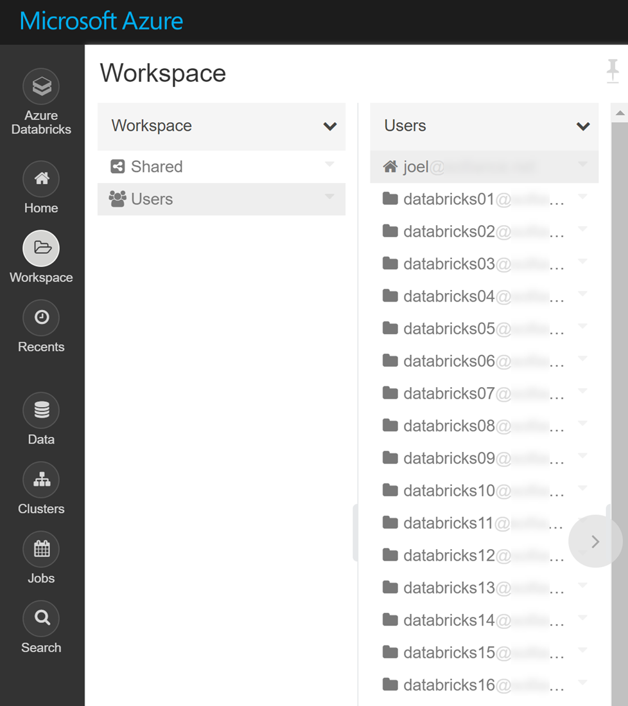
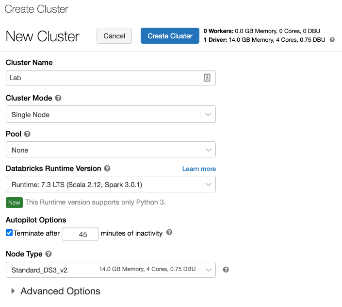
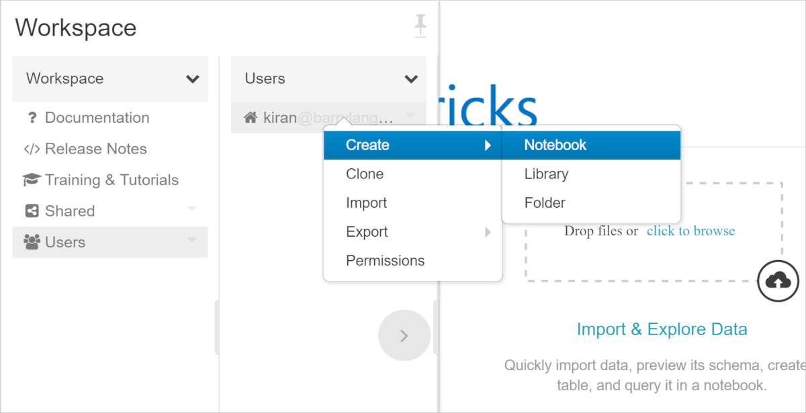
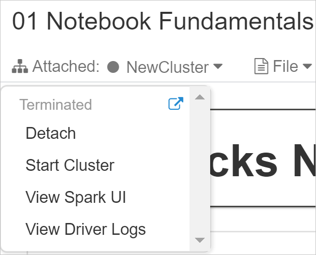

# Describe Azure Databricks

## Create an Azure Databricks workspace and cluster

+ **Note:** _In this reading you can see the steps involved in the process of creating an Azure Databricks workspace and cluster._

When talking about the Azure Databricks workspace, we refer to two different things. 

The first reference is the logical Azure Databricks environment in which clusters are created, data is stored (via DBFS), and in which the server resources are housed. 

The second reference is the more common one used within the context of Azure Databricks. That is the special root folder for all of your organization's Databricks assets, including notebooks, libraries, and dashboards, as shown below:

The first step to using Azure Databricks is to create and deploy a Databricks workspace, which is the logical environment. You can do this in the Azure portal.

### Deploy an Azure Databricks workspace

1. Open the Azure portal
2. Click **Create a Resource** in the top left
3. Search for "Databricks"
4. Select _Azure Databricks_
5. On the Azure Databricks page select Create
6. Provide the required values to create your Azure Databricks workspace:
    + **Subscription**: Choose the Azure subscription in which to deploy the workspace.
    + **Resource Group**: Use **Create new** and provide a name for the new resource group.
    + **Location**: Select a location near you for deployment. For the list of regions that are supported by Azure Databricks, see [Azure services available by region](https://azure.microsoft.com/regions/services/).
    + **Workspace Name**: Provide a unique name for your workspace.
    + **Pricing Tier: Trial (Premium - 14 days Free DBUs)**. You must select this option when creating your workspace or you will be charged. The workspace will suspend automatically after 14 days. When the trial is over you can convert the workspace to **Premium** but then you will be charged for your usage.
7. Select **Review + Create**.
8. Select **Create**.

The workspace creation takes a few minutes. During workspace creation, the **Submitting deployment for Azure Databricks** tile appears on the right side of the portal. You might need to scroll right on your dashboard to view the tile. There's also a progress bar displayed near the top of the screen. You can watch either area for progress.

+ [Use an Azure Resource Manager template to create a workspace for Azure Machine Learning](https://docs.microsoft.com/en-us/azure/machine-learning/how-to-create-workspace-template?tabs=azcli)

### What is a cluster?

The notebooks are backed by clusters, or networked computers, that work together to process your data. The first step is to create a cluster.

### Create a cluster

1. When your Azure Databricks workspace creation is complete, select the link to go to the resource.
2. Select **Launch Workspace** to open your Databricks workspace in a new tab.
3. In the left-hand menu of your Databricks workspace, select **Clusters**.
4. Select **Create Cluster** to add a new cluster.
    
5. Enter a name for your cluster. Use your name or initials to easily differentiate your cluster from those of your co-workers.
6. Select the **Cluster Mode: Single Node**.
7. Select the **Databricks RuntimeVersion: Runtime: 7.3 LTS (Scala 2.12, Spark 3.0.1)**.
8. Under **Autopilot Options**, leave the box **checked** and in the text box enter 45.
9. Select the **Node Type: Standard_DS3_v2**.
10. Select **Create Cluster**.

## Create and execute a notebook

+ **Note:** _In this reading you can see the steps involved in the process of creating and executing a notebook._

After creating your Databricks workspace, it's time to create your first notebook. To execute your notebook, you will attach the cluster you created in the previous exercise.

### What is Apache Spark notebook?

A notebook is a collection of cells. These cells are run to execute code, to render formatted text, or to display graphical visualizations.

### Create a notebook

1. In the Azure portal, click **All resources** menu on the left side navigation and select the Databricks workspace you created in the last unit.
2. Select **Launch Workspace** to open your Databricks workspace in a new tab.
3. On the left-hand menu of your Databricks workspace, select **Home**.
4. Right-click on your home folder.
5. Select **Create**.
6. Select **Notebook**.
    
7. Name your notebook **First Notebook**.
8. Set the **Language** to **Python**.
9. Select the cluster to which to attach this notebook.
    + **Note:** This option displays only when a cluster is currently running. You can still create your notebook and attach it to a cluster later.
10. Select **Create**.

Now that you've created your notebook, let's use it to run some code.

### Attach and detach your notebook

To use your notebook to run a code, you must attach it to a cluster. You can also detach your notebook from a cluster and attach it to another depending upon your organization's requirements.

If your notebook is attached to a cluster, you can:

+ Detach your notebook from the cluster
+ Restart the cluster
+ Attach to another cluster
+ Open the Spark UI
+ View the log files of the driver
